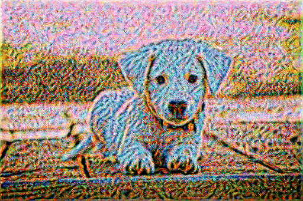
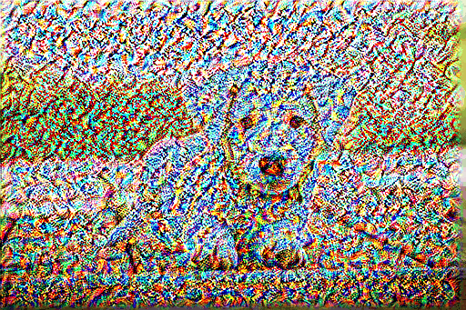
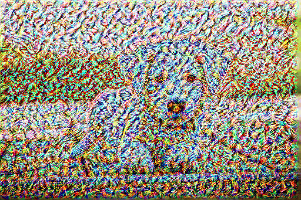
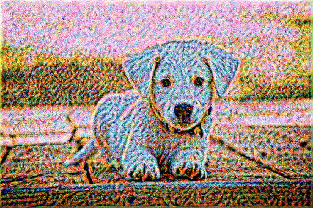
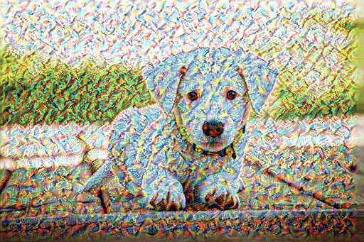
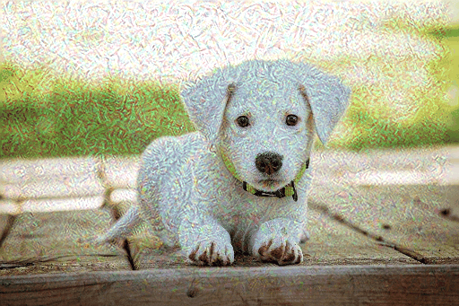
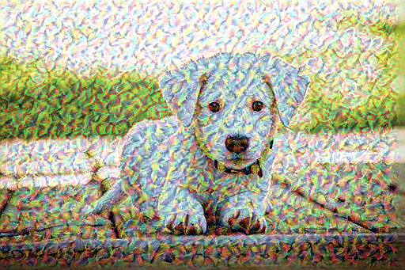
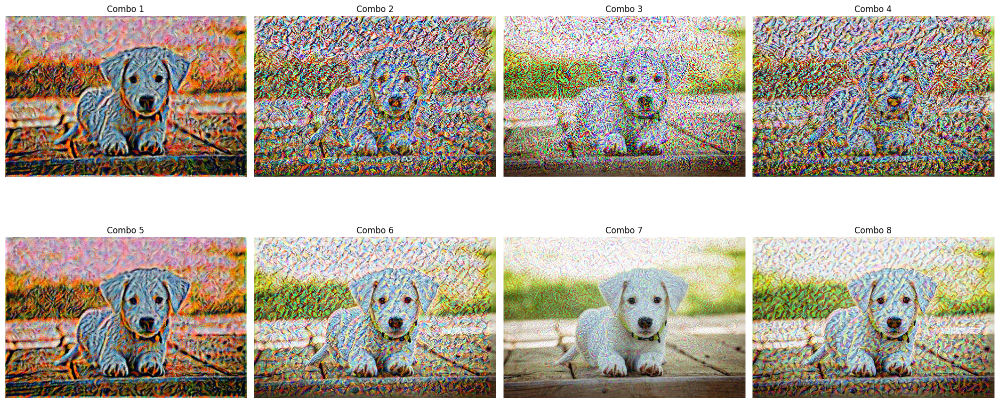

<p align="center">
  
  
  
</p>

<h1 align="center">🎨 Neural Style Transfer on Dog Image</h1>

<p align="center">
  <strong>Combining deep content with shallow style to create beautiful neural artwork.</strong><br>
  <em>Implemented using InceptionV3, TensorFlow, and multi-combo evaluation.</em>
</p>

---

## 🧠 About the Project

This project applies **Neural Style Transfer (NST)** to blend the **structure of a dog** image with the **style of an artistic painting** using the InceptionV3 architecture. Unlike traditional deep learning where weights are trained, NST directly **optimizes the image pixels** using **content and style losses**.

---

## 🚀 Highlights

- ✅ Uses pretrained **InceptionV3** as a feature extractor
- ✅ Optimizes **generated image pixels**, not model weights
- ✅ Tests **8 unique content-style layer combinations**
- ✅ Tracks and plots **content, style, and total loss curves**
- ✅ Saves stylization GIFs and per-step images

---

## 🧪 Combo Layer Configurations

| Combo | Content Layer | Style Layers                          | Content Depth | Style Depth | Result Summary |
|-------|----------------|----------------------------------------|----------------|--------------|----------------|
| 1     | `conv2d_88`     | `conv2d_0`–`conv2d_4`                 | Deep           | Shallow      | ✅ Most balanced output |
| 2     | `conv2d_88`     | `conv2d_10`–`conv2d_14`               | Deep           | Mid          | ❌ Over-stylized |
| 3     | `conv2d_88`     | `conv2d_60`–`conv2d_64`               | Deep           | Deep         | ❌ Texture dominates |
| 4     | `conv2d_88`     | Mixed                                  | Deep           | Mixed        | ⚠️ Unstable patterns |
| 5     | `conv2d_70`     | `conv2d_0`–`conv2d_4`                 | Mid            | Shallow      | ✅ Strong content, light texture |
| 6     | `conv2d_70`     | `conv2d_10`–`conv2d_14`               | Mid            | Mid          | ⚠️ Slight noise |
| 7     | `conv2d_70`     | `conv2d_60`–`conv2d_64`               | Mid            | Deep         | ✅ Most content-preserving |
| 8     | `conv2d_70`     | Mixed                                  | Mid            | Mixed        | ⚠️ Colorful, chaotic |

---

<!-- ## 🎞️ GIF Results

| Combo | Stylization |
|-------|-------------|
| Combo 1 |  |
| Combo 2 |  |
| Combo 3 |  |
| Combo 4 |  |
| Combo 5 |  |
| Combo 6 |  |
| Combo 7 |  |
| Combo 8 |  |

--- -->

## 📈 Loss Plots

<p align="center">
  
</p>

- **Total loss**, **style loss**, and **content loss** were tracked across training steps for each combo.
- These visualizations helped evaluate **stability and convergence**.

---

## 📸 Example Output

<p align="center">
  <br>
  <sub>Eight different content-style layer combinations. Combo 1 and Combo 7 show strongest balance.</sub>
</p>

---

## 🧠 Key Concepts

- 🧠 **Don't train a model** — use a pretrained model as a **feature extractor**
- 🖼️ **Train the image pixels** directly via backpropagation
- 🎨 Style is encoded using **Gram matrices** from shallow layers
- 📐 Content is encoded from deep layer **feature activations**

---

## ⚙️ Requirements

```bash
pip install -r requirements.txt
```

---

## 🛠️ Run the Notebook

```bash
jupyter notebook Neural_Style_Transfer.ipynb
```

One can customize the content/style image, combo configurations, and output formats (e.g., PNG or GIFs).

---

## ✅ Conclusion

This project demonstrates that selecting the right content and style layer depths is crucial to successful neural style transfer. **Combo 1 and Combo 7** produced the most balanced and interpretable results, while deeper style layers tended to create noisy or abstract outputs.

---

## 🙌 Credits

- Content Image: [Dog (Royalty-Free)](https://images.app.goo.gl/pU53EfBZFBdo5ZH2A)
- Style Image: [Composition VII by Wassily Kandinsky](https://www.wassily-kandinsky.org/Composition-VII.jsp)
- Based on principles from [Gatys et al. (2015)](https://arxiv.org/abs/1508.06576)
